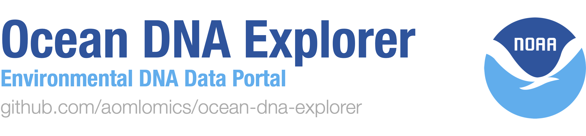

## Development Workflow

For feature requests, please raise a GitHub issue. To propose a change:

- Feature branches must be made from **dev** branch [↓ See Development Process](#development-process)

## Quick Start

### Install Node.js and npm

Install the version of [node.js](https://nodejs.org/en/download) specified in the engines.node field of the [package.json](/package.json). This should automatically install [npm](https://docs.npmjs.com/downloading-and-installing-node-js-and-npm), but you can check if it's installed:

```bash
node --version && npm --version
```

### Install Dependencies

This will only show you the site with no data. You need to setup a local PostgreSQL Database, OR visit the [main website](https://www.oceandnaexplorer.org) to see the website's full functionality.

After cloning the repository locally:

```bash
npm install --ignore-scripts
npm run dev
```

## Local Database Setup / Commands

1. Install [PostgreSQL](https://www.postgresql.org/download/)
	- Follow instructions per your system, use default parameters (NOTE: Do not change the default port of 5432)
	- Note your postgres username and password. We recommend username: postgres, password: admin.

2. Create your database using either:

	```bash
	# In terminal:
	createdb <dbname>

	# Or in psql:
	CREATE DATABASE <dbname>;
	```

3. To view all local databases in psql:

	```sql
	\l
	```

### Configure .env File

- You need to create an environment file named .env.
- This file is required to configure environment variables for the application.
- **See [.env.template](/.env.template) to see the required variables and their format.**
- In the POSTGRES_PRISMA_URL variables, replace `<username>`, `<password>`, `<server>`, and `<dbname>` with your own.

### Database Commands

1. First Time Setup (Fresh Install):

```bash
npx prisma generate	# Creates Prisma Client based on your schema
npx prisma db push	# Creates database tables based on schema
```

2. Schema Changes (Keep Data):

```bash
npx prisma db push	# Updates database schema while preserving existing data
					# Will fail if changes would cause data loss
```

3. Schema Changes (Can't Keep Data):

```bash
npx prisma db push --force-reset	# Completely resets database, deleting all data
									# Must reseed database from admin panel. If you need to be added as an admin, contact a maintainer

```

**Important: To populate the local database, you must upload the files from [ODE_testdata](https://github.com/aomlomics/ODE_testdata) by navigating to the `Submit` tab on the website.** Then, click `Submit a Project`.

## Development Process

Feature branches must be made from **dev** branch. Get latest from dev:

```bash
# If you don't have a dev branch yet locally:
git checkout -b dev origin/dev

# If you intend to make a change:
git checkout -b <featureBranchName>
git merge dev
```

## Developer Commands

Install all node dependencies from package.json:

```bash
npm install --ignore-scripts
```

Run the local test server:

```bash
npm run dev
```

Open the Prisma database view:

```bash
npx prisma studio
```

Push schema changes to database:

```bash
npx prisma migrate dev --name "<insert migration name>" --create-only
```

Clear the database of all entries:

```bash
npx prisma db push --force-reset
```

Generate Prisma Client:

```bash
npm run generate
```

## License

Ocean DNA Explorer is released under the Apache License, Version 2.0. See the `LICENSE` file for details.
